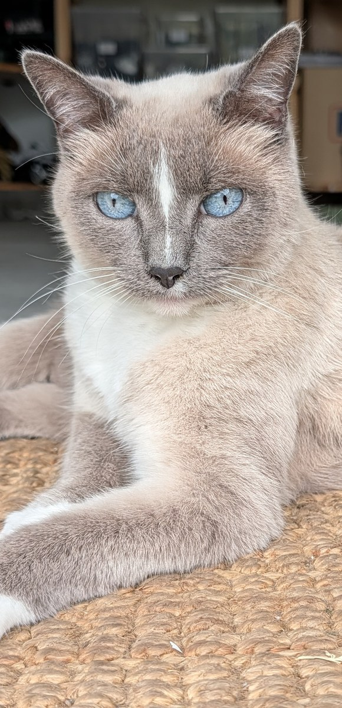
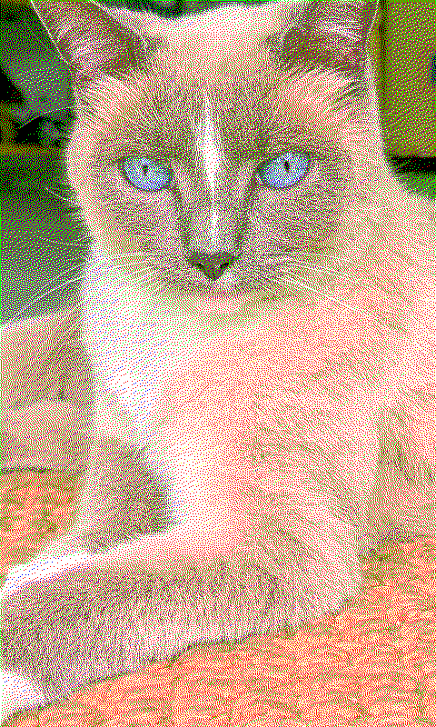
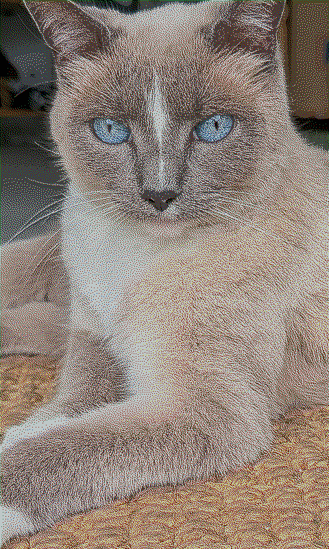

# ESP32 PhotoFrame

A modern, feature-rich firmware for ESP32-based e-paper photo frames (currently supporting **Waveshare PhotoPainter**, **Seeed Studio XIAO EE02/EE04**, **Seeed Studio reTerminal E1002**, and the **DFRobot FireBeetle 2 ESP32-E** driving a **Waveshare 4" Spectra 6** panel). This firmware replaces stock firmware with a powerful RESTful API, web interface, and **significantly better image quality**.


## Key Features

- 🎨 **Superior Image Quality**: Measured color palette with automatic calibration produces significantly better results than stock firmware
- 🔋 **Smart Power Management**: Deep sleep mode for weeks of battery life, or always-on for Home Assistant
- 📁 **Flexible Image Sources**: SD card rotation, URL-based fetching (weather, news, random images from image server)
- 🌐 **Modern Web Interface**: Drag-and-drop uploads, gallery view, real-time battery status
- 📱 **Mobile App**: [Companion app](https://github.com/aitjcize/esp32-photoframe-app) for WiFi provisioning, image processing, and AI generation
- 🖼️ **Image Server**: [Companion server](https://github.com/aitjcize/esp32-photoframe-server) with Google Photos, Synology DS Photos, and Telegram Bot support
- 🏠 **Home Assistant Ready**: [Companion integration](https://github.com/aitjcize/ha-esp32-photoframe) available
- 🔌 **RESTful API**: Full programmatic control ([API docs](docs/API.md))

## Ecosystem

This project has companion tools for different use cases:

| Project | Description |
|---------|-------------|
| [**ha-esp32-photoframe**](https://github.com/aitjcize/ha-esp32-photoframe) | Home Assistant integration for control, monitoring, and automation |
| [**esp32-photoframe-server**](https://github.com/aitjcize/esp32-photoframe-server) | Image server with text overlay, Google Photos, Synology DS Photos, and Telegram Bot integration. Can be run as a Home Assistant add-on. |
| [**esp32-photoframe-app**](https://github.com/aitjcize/esp32-photoframe-app) | Mobile companion app for WiFi provisioning and device control. iOS: [App Store](https://apps.apple.com/tw/app/esp-frame/id6762510995?l=en-GB) (USD 2.99, to offset Apple's USD 99/yr developer fee). Android: still in closed testing — join the [testers Google Group](https://groups.google.com/g/esp32-photoframe-app-testers) first, then install via [Google Play](https://play.google.com/store/apps/details?id=com.aitjcize.espframe). |
| [**epaper-image-convert**](https://github.com/aitjcize/epaper-image-convert) | CLI tool & npm library for e-paper image conversion with advanced dithering |

## Third Party Integrations

| Project | Description |
|---------|-------------|
| [**puppet**](https://github.com/balloob/home-assistant-addons/tree/main/puppet) | HA Puppet add-on. Generate image URL from Puppet dashboard and use it as the Auto Rotate URL in PhotoFrame settings. |

## Image Quality Comparison

**🎨 [Try the Interactive Demo](https://aitjcize.github.io/esp32-photoframe/)** - Drag the slider to compare algorithms in real-time with your own images!

<table>
<tr>
<td align="center"><b>Original Image</b></td>
<td align="center"><b>Stock Algorithm<br/>(on computer)</b></td>
<td align="center"><b>Stock Algorithm<br/>(on device)</b></td>
<td align="center"><b>Our Algorithm<br/>(on device)</b></td>
</tr>
<tr>
<td><a href="https://github.com/aitjcize/esp32-photoframe/raw/refs/heads/main/.img/sample.jpg"></a></td>
<td><a href="https://github.com/aitjcize/esp32-photoframe/raw/refs/heads/main/.img/stock_algorithm_on_computer.bmp"></a></td>
<td><a href="https://github.com/aitjcize/esp32-photoframe/raw/refs/heads/main/.img/stock_algorithm.bmp"></a></td>
<td><a href="https://github.com/aitjcize/esp32-photoframe/raw/refs/heads/main/.img/our_algorithm.png"></a></td>
</tr>
<tr>
<td align="center">Source JPEG</td>
<td align="center">Theoretical palette<br/>(looks OK on screen)</td>
<td align="center">Theoretical palette<br/>(washed out on device)</td>
<td align="center">Measured palette<br/>(accurate colors)</td>
</tr>
</table>

**Why Our Algorithm is Better:**

- ✅ **Accurate Color Matching**: Uses actual measured e-paper colors
- ✅ **Automatic Calibration**: Built-in palette calibration tool adapts to your specific display
- ✅ **Better Dithering**: Floyd-Steinberg algorithm with measured palette produces more natural color transitions
- ✅ **No Over-Saturation**: Avoids the washed-out appearance of theoretical palette matching

The measured palette accounts for the fact that e-paper displays show darker, more muted colors than pure RGB values. By dithering with these actual colors, the firmware makes better decisions about which palette color to use for each pixel, resulting in images that look significantly better on the physical display. The automatic calibration feature allows you to measure and optimize the palette for your specific device.

📖 **[Read the technical deep-dive on measured color palettes →](docs/MEASURED_PALETTE.md)**

## Power Management

**Deep Sleep Enabled (Default)**:
- Battery life: months
- Wake via BOOT/KEY button or auto-rotate timer
- Web interface accessible only when awake
- Power: ~10μA in sleep

**Deep Sleep Disabled (Always-On)**:
- Best for Home Assistant integration
- Web interface always accessible
- Power: ~40-80mA with auto light sleep
- Battery life: days to weeks depending on usage

**Auto-Rotation**: SD card (default) or URL-based (fetch from web)

Configure via web interface **Settings** section.

### Battery Life Estimate (FireBeetle 2 ESP32-E + 4" Spectra 6)

Worked example for the DFRobot FireBeetle 2 ESP32-E driving the Waveshare 4" Spectra 6
panel over URL rotation. **The periodic wake cycles dominate the budget — deep sleep is
< 2% of it** — so battery life scales almost linearly with the rotation interval (and with
any sleep schedule), not with the sleep current.

**Energy per wake cycle** (wake → WiFi connect → fetch image → ~19s e-paper refresh → sleep):

| Phase | Current (approx) | Time | Energy |
|-------|------------------|------|--------|
| WiFi connect + image fetch | ~110 mA | ~8 s | ~0.24 mAh |
| E-paper refresh (panel + CPU in light sleep) | ~45 mA | ~19 s | ~0.24 mAh |
| Boot / teardown | ~50 mA | ~3 s | ~0.04 mAh |
| **Per cycle** | | ~30 s | **~0.52 mAh** |

Deep sleep draws ~15–50 µA (target ~10 µA; GPIO2 is driven low before sleep so the
on-board LED doesn't leak — see the board HAL). Over a day that's < 1 mAh, i.e. negligible
next to the wake cycles.

**Per-day math** (usable LiPo capacity ≈ 80% of nominal — 4.2→3.4V plus regulator losses;
a 4000 mAh pack ≈ 3200 mAh usable):

| Rotation interval | Sleep schedule | Cycles/day | Energy/day | 4000 mAh life (≈ central) |
|-------------------|----------------|-----------|------------|----------------------------|
| 15 min | none | 96 | ~50 mAh | ~9 weeks (~2 months) |
| 15 min | 22:00–04:30 off (6.5 h) | ~70 | ~37 mAh | **~12 weeks (~3 months)** |
| 30 min | 22:00–04:30 off | ~35 | ~19 mAh | ~6 months |
| 60 min | 22:00–04:30 off | ~18 | ~10 mAh | ~10–11 months |

Sleep-schedule note: when the next rotation would land inside the schedule, the firmware
schedules the wake for the **end** of the window (`calculate_next_wakeup_interval`), so the
frame sleeps straight through with no WiFi/refresh — the saving is full, not partial.

Real-world spread is roughly ±40% (WiFi association time and panel refresh current are the
biggest unknowns). For an exact figure in your environment, log `GET /api/battery`
(returns mV + %) over a few days and extrapolate the discharge slope.

## AI Image Generation 🤖

The web interface supports client-side AI image generation using OpenAI (GPT Image, DALL-E) or Google Gemini.

- **Generate on Demand**: Create custom artwork directly from the web interface using text prompts
- **Multiple Providers**: OpenAI and Google Gemini supported
- **Client-Side Processing**: AI generation runs in your browser, then uploads to the device

Configure your API keys in **Settings > AI Generation**.


## Supported Hardware

| Board | Display | Storage | Board Name |
|-------|---------|---------|------------|
| [Waveshare PhotoPainter](https://www.waveshare.com/wiki/ESP32-S3-PhotoPainter) | 7.3" 7-color | SD card (SDIO) | `waveshare_photopainter_73` |
| [Seeed Studio XIAO EE02](https://www.seeedstudio.com/XIAO-ePaper-DIY-Kit-EE02-for-13-3-Spectratm-6-E-Ink.html) | 13.3" 6-color | Internal flash | `seeedstudio_xiao_ee02` |
| [Seeed Studio XIAO EE04](https://www.seeedstudio.com/XIAO-ePaper-EE04-DIY-Bundle-Kit.html) | 7.3" 6-color | Internal flash | `seeedstudio_xiao_ee04` |
| [Seeed Studio reTerminal E1002](https://www.seeedstudio.com/reTerminal-E1002-p-6533.html) | 7.3" 6-color | SD card (SPI) + Internal flash | `seeedstudio_reterminal_e1002` |
| [DFRobot FireBeetle 2 ESP32-E](https://www.dfrobot.com/product-2195.html) ([wiki](https://wiki.dfrobot.com/dfr0654/)) | [Waveshare 4" Spectra 6](https://www.waveshare.com/4inch-e-paper-hat-plus-e.htm) 6-color (400×600) | None — server-streamed | `dfrobot_firebeetle_esp32e` |

The reTerminal E1002 also includes a SHT40 temperature/humidity sensor, PCF8563 RTC, and battery monitoring.

**About the FireBeetle 2 ESP32-E build:** unlike the other boards this is a *classic* ESP32 (not S3) with **4 MB flash and no PSRAM**. It has no local image storage — the 4 MB flash holds a single app partition — so it relies entirely on **URL rotation / server push**, receiving uncompressed raw-EPD frames so the SRAM-only chip doesn't run out of memory decoding images. Battery is monitored on GPIO34, it wakes on a single button (see [configurable wake-button gestures](#button-functions)), and because it has no PSRAM it **cannot fetch over `https://`** (the TLS handshake won't fit in RAM alongside the 120 KB framebuffer) — use a plain `http://` image URL on the LAN, or a reverse proxy. The firmware reports this via the `system-info` `https_supported` flag so the web UIs warn against `https://` URLs on this board.

### Button Functions

Buttons behave differently depending on whether the device is awake (web UI accessible) or in deep sleep.

**When in deep sleep:**

| Button | Waveshare PhotoPainter | XIAO EE02 / EE04 | reTerminal E1002 | FireBeetle 2 ESP32-E |
|--------|----------------------|-------------------|------------------|----------------------|
| **Wake** | BOOT button | Button 3 | Green button | Wake button (single) |
| **Rotate** | KEY button | Button 1 | Left button | (single button)¹ |
| **Clear** | N/A | Button 2 | Right button | (single button)¹ |

¹ The FireBeetle has a single wake button; rotate/clear/info are reached through its **configurable wake-button gestures** (see below) rather than dedicated buttons.

- **Wake**: Wakes the device and starts the web UI / HTTP server (stays awake)
- **Rotate**: Wakes the device, rotates to the next image, then goes back to sleep
- **Clear**: Wakes the device, clears the display to white, then goes back to sleep

**When awake:**

| Button | Function |
|--------|----------|
| **Rotate** | Rotates to the next image |
| **Clear** | Clears the display to white |

**Configurable wake-button gestures** (single-button boards such as the FireBeetle 2 ESP32-E): the wake button's awake behaviour is configurable per gesture from the web UI (frame and server) — **short press** (<2s), **long press** (2–5s) and **hold** (≥5s) each map to an action: next image, go to deep sleep, toggle deep sleep on/off, or show an on-screen info card (name, IP, Wi-Fi SSID, server URL, firmware version). Defaults: short → next image, long → sleep, hold → info screen. Waking from deep sleep is always implicit (any press wakes the frame first).

### 💾 Internal Flash Storage
Boards with larger flash chips (XIAO EE02/EE04, reTerminal E1002) use internal flash as persistent storage via LittleFS. On the reTerminal, the SD card takes priority when inserted; internal flash serves as a fallback. The Waveshare board does not have internal flash storage due to its 16MB flash being fully allocated to OTA partitions. The **FireBeetle 2 ESP32-E** has no local image storage at all (its 4 MB flash is a single app partition) — it fetches every image on demand via URL rotation / server push.

### Known Issues 🚧

- **PhotoPainter Restarts**: All existing Waveshare PhotoPainter boards on the market use the AXP2101 power management IC, which causes unexplained restarts when connected to both Type-C and a lithium battery simultaneously. **Workaround:** use either USB power only or battery only. Using both at the same time may cause frequent firmware restarts due to unstable power supply. Waveshare has confirmed this issue and future boards will ship with TG28 as a replacement, which will not have this problem. See [waveshareteam/ESP32-S3-PhotoPainter#5](https://github.com/waveshareteam/ESP32-S3-PhotoPainter/issues/5#issuecomment-3876269519) for details.
- **Seeed Studio Deep Sleep & USB Power**: The XIAO EE02, XIAO EE04, and reTerminal E1002 can only detect USB connections from a **PC** (via USB-Serial-JTAG SOF packets). Chargers and power banks will **not** keep the device awake — it will enter deep sleep as normal. This is a hardware limitation: these boards do not route USB VBUS to an ESP32 GPIO. The Waveshare PhotoPainter does not have this limitation as it uses the AXP2101 PMIC for USB power detection. **Workaround:** If you want the device to stay always accessible while powered by a charger or power bank, disable deep sleep in **Settings > General**.

## Installation

### Web Flasher (Easiest) ⚡

**[🌐 Flash from Browser](https://aitjcize.github.io/esp32-photoframe/#flash)** - Chrome/Edge/Opera required

> **Note:** the browser flasher and the upstream CI releases cover the **ESP32-S3** boards only. The **FireBeetle 2 ESP32-E** is a classic ESP32 built manually — its flashable factory bin is published on this fork's [Releases](https://github.com/Snille/esp32-photoframe/releases) under tags named `firebeetle-v<version>` (e.g. `firebeetle-v2.9.1`). Flash it with esptool as shown below.

### Manual Flash

Download from [Releases](https://github.com/aitjcize/esp32-photoframe/releases) (or the [Snille fork Releases](https://github.com/Snille/esp32-photoframe/releases) for the FireBeetle bin):

```bash
# ESP32-S3 boards (Waveshare PhotoPainter, XIAO EE02/EE04, reTerminal E1002)
esptool.py --chip esp32s3 --port /dev/ttyUSB0 --baud 921600 write_flash 0x0 photoframe-firmware-<board>-merged.bin

# DFRobot FireBeetle 2 ESP32-E (classic ESP32)
esptool.py --chip esp32 --port /dev/ttyUSB0 --baud 460800 write_flash 0x0 photoframe-firmware-dfrobot_firebeetle_esp32e-merged.bin
```

The FireBeetle's merged bin flashes at `0x0` and leaves NVS (Wi-Fi config) untouched, so a reflash keeps your credentials.

**Device not detected?** Hold BOOT button + press PWR to enter download mode. On the FireBeetle, flashing is most reliable with the board **awake** (press the wake button first) and hands off the buttons during flashing.

**Build from source:**

We provide a `build.py` helper script to simplify building for different boards.

```bash
# Build for Waveshare PhotoPainter (default)
./build.py --board waveshare_photopainter_73

# Build for Seeed Studio XIAO EE02
./build.py --board seeedstudio_xiao_ee02

# Build for Seeed Studio XIAO EE04
./build.py --board seeedstudio_xiao_ee04

# Build for Seeed Studio reTerminal E1002
./build.py --board seeedstudio_reterminal_e1002

# Build for DFRobot FireBeetle 2 ESP32-E (classic ESP32, ESP-IDF v5.3.3)
./build.py --board dfrobot_firebeetle_esp32e

# Flash the firmware
idf.py -p /dev/ttyUSB0 flash monitor
```

> The ESP32-S3 boards build against ESP-IDF v6.0; the **FireBeetle 2 ESP32-E** target builds against **ESP-IDF v5.3.3** (classic ESP32, app at `0x10000`, 4 MB / dio / 40 MHz). See [docs/DEV.md](docs/DEV.md) for the per-board toolchain and the merged-bin recipe.

For more details, see [DEV.md](docs/DEV.md)

### WiFi Provisioning

The device supports two methods for WiFi provisioning:

#### Option 1: SD Card Provisioning (boards with SD card only)

1. Create a file named `wifi.txt` on your SD card with:
   ```
   YourWiFiSSID
   YourWiFiPassword
   MyPhotoFrame
   ```
   - Line 1: WiFi SSID (network name)
   - Line 2: WiFi password
   - Line 3: Device name (optional, defaults to "PhotoFrame")
   - Use plain text, no quotes or extra formatting
   - The file can be placed at the root or in a `config/` folder

2. Insert SD card and power on the device
3. Device automatically reads credentials, saves to memory, and connects
4. The `wifi.txt` file is automatically deleted after reading (to prevent issues with invalid credentials)

**Note**: If credentials are invalid, the device will clear them and fall back to captive portal mode.

#### Option 2: Captive Portal

1. Device creates a unique AP on first boot (e.g. `PhotoFrame - A1B2C3`, where `A1B2C3` is derived from the device's MAC address)
2. Connect to the AP and open `http://192.168.4.1` (or use captive portal)
3. Enter WiFi credentials (2.4GHz only)
4. Device tests connection and saves if successful

#### Option 3: Companion App

1. Install the ESP Frame companion app:
   - **iOS**: [App Store](https://apps.apple.com/tw/app/esp-frame/id6762510995?l=en-GB)
   - **Android**: join the [testers Google Group](https://groups.google.com/g/esp32-photoframe-app-testers) (closed testing), then install from [Google Play](https://play.google.com/store/apps/details?id=com.aitjcize.espframe)
2. Tap the "+" button on the home screen
3. The app scans for PhotoFrame setup hotspots, connects automatically, and guides you through WiFi configuration

**Re-provision:** Delete credentials with `idf.py erase-flash` or place new `wifi.txt` on SD card after clearing stored credentials

## Usage

**Web Interface:** `http://photoframe.local` or device IP address
- Gallery view with drag-and-drop uploads
- Settings, battery status, display control

**API:** Full documentation in [API.md](docs/API.md)

## Troubleshooting

- **WiFi issues**: Ensure 2.4GHz network, check serial monitor for IP
- **SD card not detected**: Format as FAT32, try different card
- **Upload fails**: Check file is valid JPEG, monitor serial output
- **Device not detected for flash**: Hold BOOT + press PWR for download mode

## Offline Image Processing

Node.js CLI tool for batch processing and image serving:

### Batch Processing
```bash
cd process-cli && npm install
# Process to disk
node cli.js input.jpg --device-parameters -o /path/to/sdcard/images/

# Or upload directly to device
node cli.js ~/Photos/Albums --upload --device-parameters --host photoframe.local
```

### Image Server Mode
Serve pre-processed images directly to your ESP32 over HTTP:

```bash
node cli.js --serve ~/Photos --serve-port 9000 --device-parameters --host photoframe.local
```

The ESP32 can fetch images from your computer instead of storing them on SD card. Supports EPDGZ, BMP, PNG, and JPG formats with automatic thumbnail generation.

See [process-cli/README.md](process-cli/README.md) for details.

**Building your own image server?** The firmware's URL rotation fetch protocol — request method, custom `X-*` headers, `Authorization` / custom-header handling, and the `ETag` / `304 Not Modified` caching flow — is documented in [docs/API.md → URL Rotation Fetch](docs/API.md#url-rotation-fetch).

## Support

If you find this project useful, consider buying me a coffee! ☕

[](https://buymeacoffee.com/aitjcize)

## License

This project is based on the ESP32-S3-PhotoPainter sample code. Please refer to the original project for licensing information.

## Credits

- Original PhotoPainter sample: Waveshare ESP32-S3-PhotoPainter
- E-paper drivers: Waveshare
- ESP-IDF: Espressif Systems
